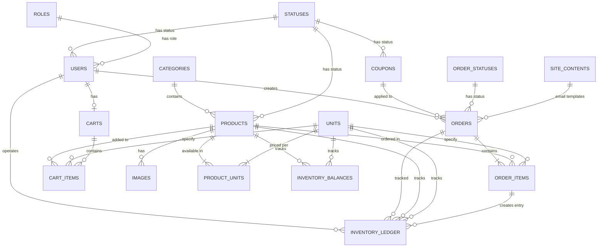

# 資料庫架構文件 (Database Schema Documentation)

## 概述 (Overview)

本文件詳細說明了農業管理系統的資料庫架構，包括所有表格、欄位、關係和約束條件。

---

## 實體關係圖 (ER Diagram)



---

## 表格詳細說明 (Table Specifications)

### 1. **users** - 用戶表
用戶帳戶和認證資訊

| 欄位 | 類型 | 約束 | 說明 |
|------|------|------|------|
| id | UUID | PK | 用戶唯一識別碼 |
| email | VARCHAR(120) | UNIQUE, NOT NULL | 用戶郵件 |
| user_name | VARCHAR(20) | NOT NULL | 用戶名稱 |
| password_hash | VARCHAR(200) | NOT NULL | 密碼雜湊值 |
| email_verified_at | TIMESTAMP | NULLABLE | 郵件驗證時間 |
| role_code | INTEGER | FK → roles.code | 用戶角色代碼 |
| status_code | INTEGER | FK → statuses.code | 用戶狀態代碼 |
| created_at | TIMESTAMP | NOT NULL | 建立時間 |
| updated_at | TIMESTAMP | NOT NULL | 更新時間 |

**索引:**
- `idx_users_email` - email欄位
- `idx_users_role_code` - role_code欄位
- `idx_users_status_code` - status_code欄位

**關係:**
- 一對多: users → orders (一個用戶可以下多個訂單)
- 一對零或一: users → carts (一個用戶只有一個購物車)
- 一對多: users → inventory_ledger (用戶操作庫存)

---

### 2. **products** - 產品表
農產品基本資訊

| 欄位 | 類型 | 約束 | 說明 |
|------|------|------|------|
| id | UUID | PK | 產品唯一識別碼 |
| name | VARCHAR(120) | NOT NULL | 產品名稱 |
| origin | VARCHAR(120) | NULLABLE | 產品原產地 |
| price | INTEGER | NOT NULL, CHECK >= 0 | 基礎價格 (單位: 分) |
| stock | INTEGER | NOT NULL, CHECK >= 0 | 基礎庫存數量 |
| low_stock_threshold | INTEGER | NULLABLE, CHECK >= 0 | 低庫存警告閾值 |
| description | TEXT | NULLABLE | 產品描述 |
| category_id | UUID | FK → categories.id | 產品分類 |
| status_code | INTEGER | FK → statuses.code | 產品狀態 |
| created_at | TIMESTAMP | NOT NULL | 建立時間 |
| updated_at | TIMESTAMP | NOT NULL | 更新時間 |

**索引:**
- `idx_products_name` - name欄位
- `idx_products_category_id` - category_id欄位
- `idx_products_status_code` - status_code欄位
- `idx_products_created_at` - created_at欄位

**約束檢查:**
- `ck_products_price_non_negative` - price >= 0
- `ck_products_stock_non_negative` - stock >= 0
- `ck_products_low_stock_threshold_non_negative` - low_stock_threshold >= 0

**關係:**
- 多對一: products → categories
- 多對一: products → statuses
- 一對多: products → product_units
- 一對多: products → order_items
- 一對多: products → cart_items
- 一對多: products → images
- 一對多: products → inventory_balances
- 一對多: products → inventory_ledger

---

### 3. **product_units** - 產品單位關聯表
產品與單位的多對多關係，儲存各單位的價格和庫存

| 欄位 | 類型 | 約束 | 說明 |
|------|------|------|------|
| product_id | UUID | FK → products.id, PK | 產品ID |
| unit_id | UUID | FK → units.id, PK | 單位ID |
| price | INTEGER | NOT NULL | 此單位的價格 (單位: 分) |
| stock | INTEGER | NOT NULL | 此單位的庫存 |

**關係類型:** 多對多關聯表

---

### 4. **units** - 單位表
產品計量單位 (如: kg, 個, 箱)

| 欄位 | 類型 | 約束 | 說明 |
|------|------|------|------|
| id | UUID | PK | 單位唯一識別碼 |
| name | VARCHAR(20) | UNIQUE, NOT NULL | 單位名稱 |

**關係:**
- 一對多: units → product_units
- 一對多: units → order_items
- 一對多: units → cart_items
- 一對多: units → inventory_balances
- 一對多: units → inventory_ledger

---

### 5. **categories** - 分類表
產品分類

| 欄位 | 類型 | 約束 | 說明 |
|------|------|------|------|
| id | UUID | PK | 分類唯一識別碼 |
| name | VARCHAR(60) | UNIQUE, NOT NULL | 分類名稱 |
| meta_data | JSONB | NULLABLE | 分類元資料 |
| created_at | TIMESTAMP | NOT NULL | 建立時間 |
| updated_at | TIMESTAMP | NOT NULL | 更新時間 |

**關係:**
- 一對多: categories → products

---

### 6. **images** - 圖片表
產品圖片儲存

| 欄位 | 類型 | 約束 | 說明 |
|------|------|------|------|
| id | UUID | PK | 圖片唯一識別碼 |
| product_id | UUID | FK → products.id | 所屬產品 |
| stored_filename | VARCHAR(300) | NOT NULL | 儲存的檔案名 |
| file_url | VARCHAR(300) | NOT NULL | 圖片URL |
| is_primary | BOOLEAN | NOT NULL, DEFAULT false | 是否為主圖 |
| sort_order | INTEGER | NOT NULL, DEFAULT 0 | 排序順序 |
| created_at | TIMESTAMP | NOT NULL | 建立時間 |

**索引:**
- `idx_images_product_id` - product_id欄位

---

### 7. **orders** - 訂單表
客戶訂單

| 欄位 | 類型 | 約束 | 說明 |
|------|------|------|------|
| id | UUID | PK | 訂單唯一識別碼 |
| order_no | VARCHAR(20) | UNIQUE, NOT NULL | 訂單編號 |
| customer_email | VARCHAR(120) | NOT NULL | 客戶郵件 |
| customer_name | VARCHAR(100) | NULLABLE | 客戶姓名 |
| address | VARCHAR(255) | NULLABLE | 配送地址 |
| coupon_code | VARCHAR(50) | NULLABLE | 優惠券代碼 |
| subtotal_amount | INTEGER | NOT NULL, DEFAULT 0 | 小計金額 (單位: 分) |
| discount_amount | INTEGER | NOT NULL, DEFAULT 0 | 優惠折扣額 |
| shipping_fee | INTEGER | NOT NULL, DEFAULT 0 | 運費 |
| manual_adjustment_amount | INTEGER | NOT NULL, DEFAULT 0 | 手動調整金額 |
| total_amount | INTEGER | NOT NULL, DEFAULT 0 | 總金額 |
| delivery_method | INTEGER | NOT NULL | 配送方式代碼 |
| payment_method | INTEGER | NOT NULL | 付款方式代碼 |
| memo | VARCHAR(255) | NULLABLE | 訂單備註 |
| bank_transfer_last5 | VARCHAR(5) | NULLABLE | 銀行轉帳末5碼 |
| orderer_name | VARCHAR(100) | NULLABLE | 訂購人姓名 |
| orderer_phone | VARCHAR(20) | NULLABLE | 訂購人電話 |
| orderer_email | VARCHAR(120) | NULLABLE | 訂購人郵件 |
| admin_note | VARCHAR(500) | NULLABLE | 管理員備註 |
| status_code | INTEGER | FK → statuses.code | 訂單狀態 |
| order_status_code | INTEGER | FK → order_statuses.code | 訂單處理狀態 |
| user_id | UUID | FK → users.id | 下訂單的用戶 |
| created_at | TIMESTAMP | NOT NULL | 建立時間 |
| updated_at | TIMESTAMP | NOT NULL | 更新時間 |

**索引:**
- `idx_orders_user_id` - user_id欄位
- `idx_orders_customer_email` - customer_email欄位
- `idx_orders_coupon_code` - coupon_code欄位
- `idx_orders_status_code` - status_code欄位
- `idx_orders_order_status_code` - order_status_code欄位
- `idx_orders_created_at` - created_at欄位

**關係:**
- 多對一: orders → users
- 多對一: orders → order_statuses
- 多對一: orders → statuses
- 一對多: orders → order_items
- 一對多: orders → inventory_ledger

---

### 8. **order_items** - 訂單項目表
訂單中的個別產品

| 欄位 | 類型 | 約束 | 說明 |
|------|------|------|------|
| id | UUID | PK | 訂單項目唯一識別碼 |
| order_id | UUID | FK → orders.id | 所屬訂單 |
| product_id | UUID | FK → products.id | 產品 |
| unit_id | UUID | FK → units.id, NULLABLE | 選擇的單位 |
| unit | VARCHAR(20) | NULLABLE | 單位文字 (快照) |
| quantity | INTEGER | NOT NULL, CHECK >= 1 | 數量 |

**索引:**
- `idx_order_items_order_id` - order_id欄位
- `idx_order_items_product_id` - product_id欄位

**約束檢查:**
- `ch_order_items_quantity_positive` - quantity >= 1

**關係:**
- 多對一: order_items → orders
- 多對一: order_items → products
- 多對一: order_items → units (可選)
- 一對多: order_items → inventory_ledger

---

### 9. **carts** - 購物車表
用戶購物車

| 欄位 | 類型 | 約束 | 說明 |
|------|------|------|------|
| id | UUID | PK | 購物車唯一識別碼 |
| user_id | UUID | FK → users.id, UNIQUE | 用戶ID (一個用戶一個購物車) |

**索引:**
- `idx_carts_user_id` - user_id欄位

**關係:**
- 一對一: carts ← users
- 一對多: carts → cart_items

---

### 10. **cart_items** - 購物車項目表
購物車中的項目

| 欄位 | 類型 | 約束 | 說明 |
|------|------|------|------|
| id | UUID | PK | 購物車項目唯一識別碼 |
| cart_id | UUID | FK → carts.id | 所屬購物車 |
| product_id | UUID | FK → products.id | 產品 |
| unit_id | UUID | FK → units.id, NULLABLE | 選擇的單位 |
| quantity | INTEGER | NOT NULL, DEFAULT 1, CHECK >= 1 | 數量 |

**索引:**
- `idx_cart_items_cart_id` - cart_id欄位

**約束檢查:**
- `ck_cart_items_quantity_positive` - quantity >= 1

---

### 11. **coupons** - 優惠券表
優惠券/折扣代碼

| 欄位 | 類型 | 約束 | 說明 |
|------|------|------|------|
| id | UUID | PK | 優惠券唯一識別碼 |
| code | VARCHAR(50) | UNIQUE, NOT NULL | 優惠券代碼 |
| name | VARCHAR(120) | NOT NULL | 優惠券名稱 |
| discount_type | INTEGER | NOT NULL | 折扣類型 (1=固定金額, 2=百分比) |
| discount_value | INTEGER | NOT NULL, CHECK >= 0 | 折扣值 |
| min_order_amount | INTEGER | NULLABLE | 最低訂單金額 |
| max_discount_amount | INTEGER | NULLABLE | 最高折扣金額 |
| usage_limit | INTEGER | NULLABLE | 使用次數限制 |
| used_count | INTEGER | NOT NULL, DEFAULT 0, CHECK >= 0 | 已使用次數 |
| starts_at | TIMESTAMP | NULLABLE | 開始時間 |
| ends_at | TIMESTAMP | NULLABLE | 結束時間 |
| status_code | INTEGER | FK → statuses.code | 優惠券狀態 |
| created_at | TIMESTAMP | NOT NULL | 建立時間 |
| updated_at | TIMESTAMP | NOT NULL | 更新時間 |

**索引:**
- `idx_coupons_code` - code欄位
- `idx_coupons_status_code` - status_code欄位
- `idx_coupons_starts_at` - starts_at欄位
- `idx_coupons_ends_at` - ends_at欄位

**約束檢查:**
- `ck_coupons_discount_value_non_negative` - discount_value >= 0
- `ck_coupons_used_count_non_negative` - used_count >= 0

---

### 12. **inventory_balances** - 庫存結餘表
每個產品-單位組合的庫存狀態快照

| 欄位 | 類型 | 約束 | 說明 |
|------|------|------|------|
| id | UUID | PK | 庫存結餘唯一識別碼 |
| product_id | UUID | FK → products.id | 產品 |
| unit_id | UUID | FK → units.id | 單位 |
| initial_stock | INTEGER | NOT NULL, CHECK >= 0 | 初始庫存 |
| actual_stock | INTEGER | NOT NULL, CHECK >= 0 | 實際庫存 |
| reserved_stock | INTEGER | NOT NULL, CHECK >= 0 | 預留庫存 |
| manual_adjustment_stock | INTEGER | NOT NULL | 手動調整庫存 |
| created_at | TIMESTAMP | NOT NULL | 建立時間 |
| updated_at | TIMESTAMP | NOT NULL | 更新時間 |

**索引:**
- `idx_inventory_balances_product_id` - product_id欄位
- `idx_inventory_balances_unit_id` - unit_id欄位

**唯一約束:**
- `uq_inventory_balances_product_unit` - (product_id, unit_id)

**約束檢查:**
- `ck_inventory_balances_initial_non_negative` - initial_stock >= 0
- `ck_inventory_balances_actual_non_negative` - actual_stock >= 0
- `ck_inventory_balances_reserved_non_negative` - reserved_stock >= 0
- `ck_inventory_balances_actual_gte_reserved` - actual_stock >= reserved_stock

**說明:**
- `actual_stock` = 實際可用庫存
- `reserved_stock` = 已預留但未出貨的庫存
- 可用庫存 = actual_stock - reserved_stock

---

### 13. **inventory_ledger** - 庫存帳簿表
庫存變動追蹤紀錄

| 欄位 | 類型 | 約束 | 說明 |
|------|------|------|------|
| id | UUID | PK | 帳簿項目唯一識別碼 |
| product_id | UUID | FK → products.id | 產品 |
| unit_id | UUID | FK → units.id | 單位 |
| order_id | UUID | FK → orders.id, NULLABLE | 關聯訂單 (可選) |
| order_item_id | UUID | FK → order_items.id, NULLABLE | 關聯訂單項目 (可選) |
| action | VARCHAR(32) | NOT NULL | 動作類型 (如: 'order', 'adjustment', 'return') |
| quantity | INTEGER | NOT NULL, DEFAULT 0 | 異動數量 |
| delta_actual | INTEGER | NOT NULL, DEFAULT 0 | 實際庫存變化 |
| delta_reserved | INTEGER | NOT NULL, DEFAULT 0 | 預留庫存變化 |
| actual_after | INTEGER | NOT NULL, DEFAULT 0 | 異動後實際庫存 |
| reserved_after | INTEGER | NOT NULL, DEFAULT 0 | 異動後預留庫存 |
| available_after | INTEGER | NOT NULL, DEFAULT 0 | 異動後可用庫存 |
| from_order_status_code | INTEGER | NULLABLE | 訂單原狀態代碼 |
| to_order_status_code | INTEGER | NULLABLE | 訂單新狀態代碼 |
| operator_user_id | UUID | FK → users.id, NULLABLE | 操作用戶 |
| note | VARCHAR(500) | NULLABLE | 備註 |
| created_at | TIMESTAMP | NOT NULL | 建立時間 |

**索引:**
- `idx_inventory_ledger_product_unit` - (product_id, unit_id)
- `idx_inventory_ledger_order_item` - order_item_id欄位
- `idx_inventory_ledger_created_at` - created_at欄位
- `idx_inventory_ledger_operator_user_id` - operator_user_id欄位

**關係:**
- 多對一: inventory_ledger → products
- 多對一: inventory_ledger → units
- 多對一: inventory_ledger → orders (可選)
- 多對一: inventory_ledger → order_items (可選)
- 多對一: inventory_ledger → users (可選)

---

### 14. **order_statuses** - 訂單狀態表
訂單處理狀態與郵件範本

| 欄位 | 類型 | 約束 | 說明 |
|------|------|------|------|
| id | UUID | PK | 狀態唯一識別碼 |
| code | INTEGER | UNIQUE, NOT NULL | 狀態代碼 |
| name | VARCHAR(50) | NOT NULL | 狀態名稱 |
| customer_email_subject_template | VARCHAR(255) | NULLABLE | 客戶郵件主旨範本 |
| customer_email_body_template | TEXT | NULLABLE | 客戶郵件內容範本 |
| admin_email_subject_template | VARCHAR(255) | NULLABLE | 管理員郵件主旨範本 |
| admin_email_body_template | TEXT | NULLABLE | 管理員郵件內容範本 |

**關係:**
- 一對多: order_statuses → orders

---

### 15. **statuses** - 通用狀態表
系統通用狀態表

| 欄位 | 類型 | 約束 | 說明 |
|------|------|------|------|
| id | UUID | PK | 狀態唯一識別碼 |
| code | INTEGER | UNIQUE, NOT NULL | 狀態代碼 |
| name | VARCHAR(50) | NOT NULL | 狀態名稱 |

**用途:**
- 產品狀態 (上架/下架/草稿)
- 用戶狀態 (活躍/停用)
- 優惠券狀態 (啟用/停用/已過期)

---

### 16. **roles** - 角色表
用戶角色

| 欄位 | 類型 | 約束 | 說明 |
|------|------|------|------|
| id | UUID | PK | 角色唯一識別碼 |
| code | INTEGER | UNIQUE, NOT NULL | 角色代碼 |
| name | VARCHAR(50) | UNIQUE, NOT NULL | 角色名稱 |

**常見角色:**
- 1: 管理員 (admin)
- 2: 客戶 (customer)
- 3: 賣家 (seller) - 可能

---

### 17. **site_contents** - 網站內容表
動態網站內容 (如郵件範本、頁面內容)

| 欄位 | 類型 | 約束 | 說明 |
|------|------|------|------|
| id | UUID | PK | 內容唯一識別碼 |
| page_key | VARCHAR(80) | UNIQUE, NOT NULL, INDEX | 內容鑰匙 |
| content_data | JSONB | NOT NULL | 內容資料 (JSON格式) |
| created_at | TIMESTAMP | NOT NULL | 建立時間 |
| updated_at | TIMESTAMP | NOT NULL | 更新時間 |

**常見 page_key:**
- `order_email_templates`
- `homepage_content`
- `footer_content`

---

## 關鍵設計模式 (Key Design Patterns)

### 1. **多對多關係**
```
Products ←→ Units (via ProductUnits)
```
- 每個產品可以有多個單位 (如: kg, 箱, 個)
- 每個單位可以用於多個產品
- ProductUnits表儲存該產品-單位組合的價格和庫存

### 2. **庫存管理**
使用雙層庫存系統：
- **InventoryBalance**: 當前快照，易於查詢
- **InventoryLedger**: 完整歷史記錄，用於審計

```
available_stock = actual_stock - reserved_stock
```

### 3. **訂單流程**
```
Order (主訂單)
  ├── OrderItem 1 (產品1，數量x)
  ├── OrderItem 2 (產品2，數量y)
  └── InventoryLedger 記錄
      └── 追蹤庫存變動
```

### 4. **狀態管理**
- **orders.status_code**: 訂單基本狀態 (待處理/已完成/已取消)
- **orders.order_status_code**: 訂單處理狀態 (待出貨/已出貨/已交付)

### 5. **遠景擴展性**
- 使用 UUID 作為主鍵，便於分散式系統
- JSONB 欄位用於靈活儲存 (如 metadata, email templates)
- 完整的審計軌跡 (created_at, updated_at, operator_user_id)

---

## 資料完整性約束 (Data Integrity Constraints)

### 非負值約束
- 產品價格 >= 0
- 庫存數量 >= 0
- 優惠券折扣值 >= 0

### 業務邏輯約束
- 實際庫存 >= 預留庫存
- 訂單項目數量 >= 1
- 購物車項目數量 >= 1
- 優惠券使用次數 <= 使用限制

### 唯一性約束
- 用戶郵件唯一
- 訂單編號唯一
- 優惠券代碼唯一
- 產品-單位組合唯一
- 分類名稱唯一
- 單位名稱唯一

---

## 索引策略 (Indexing Strategy)

### 高頻查詢索引
| 表格 | 索引 | 用途 |
|------|------|------|
| users | email | 登入查詢 |
| orders | user_id, created_at | 用戶訂單查詢 |
| products | category_id, name | 產品搜尋 |
| inventory_ledger | product_id, unit_id, created_at | 庫存變動查詢 |

### 外鍵索引
所有外鍵自動建立索引，加快關聯查詢

---

## 版本控制 (Versioning)

**資料庫版本:** 使用 Alembic 管理遷移

遷移位置: `alembic/versions/`

常見遷移:
- 新增欄位
- 修改欄位類型
- 新增表格
- 新增約束
- 調整索引

---

## 效能考慮 (Performance Considerations)

### 查詢優化
1. **訂單查詢**: 使用 user_id + created_at 複合索引
2. **庫存查詢**: 使用 product_id + unit_id 複合索引
3. **產品搜尋**: 使用 category_id + status_code 索引

### 查詢範例

**獲取用戶最近訂單:**
```sql
SELECT * FROM orders 
WHERE user_id = $1 
ORDER BY created_at DESC 
LIMIT 10;
```

**查詢產品可用庫存:**
```sql
SELECT actual_stock - reserved_stock as available 
FROM inventory_balances 
WHERE product_id = $1 AND unit_id = $2;
```

**獲取訂單庫存變動歷史:**
```sql
SELECT * FROM inventory_ledger 
WHERE order_id = $1 
ORDER BY created_at ASC;
```

---

## 資料備份與恢復 (Backup & Recovery)

建議:
- 每日完整備份
- 每小時增量備份
- 保留至少30天備份
- 定期測試恢復程序

---

## 安全性考量 (Security Considerations)

1. **密碼**: 使用 password_hash，永遠不儲存明文密碼
2. **郵件驗證**: email_verified_at 追蹤驗證狀態
3. **審計日誌**: inventory_ledger 記錄所有庫存變動
4. **操作人員**: operator_user_id 追蹤誰進行了操作
5. **敏感資訊**: admin_note, bank_transfer_last5 僅限管理員存取

---

## 常見查詢模式 (Common Query Patterns)

### 1. 完整訂單詳情
```python
# 包括客戶、項目、產品、單位
SELECT o.*, oi.*, p.name, u.name 
FROM orders o
JOIN order_items oi ON o.id = oi.order_id
JOIN products p ON oi.product_id = p.id
LEFT JOIN units u ON oi.unit_id = u.id
WHERE o.id = $1;
```

### 2. 產品庫存狀態
```python
# 查詢產品各單位的庫存
SELECT pu.unit_id, u.name, pu.stock, ib.actual_stock, ib.reserved_stock
FROM product_units pu
JOIN units u ON pu.unit_id = u.id
LEFT JOIN inventory_balances ib ON pu.product_id = ib.product_id AND pu.unit_id = ib.unit_id
WHERE pu.product_id = $1;
```

### 3. 用戶購物車
```python
# 獲取購物車全部項目
SELECT ci.*, p.name, p.price, u.name 
FROM cart_items ci
JOIN products p ON ci.product_id = p.id
LEFT JOIN units u ON ci.unit_id = u.id
WHERE ci.cart_id = (SELECT id FROM carts WHERE user_id = $1);
```

---

## 注意事項 (Important Notes)

1. **時區**: 所有 TIMESTAMP 欄位都使用 UTC+0，應用層需要轉換為本地時間
2. **金額單位**: 所有金額以「分」為單位儲存 (例: 100 = 1 元)，避免浮點數精度問題
3. **軟刪除**: 目前未使用軟刪除機制，刪除是永久的
4. **級聯刪除**: 某些關係設定了級聯刪除，刪除父記錄會自動刪除子記錄

---

## 文件更新日期

- 建立日期: 2026-06-24
- 最後更新: 2026-06-24
- 下一次審查: 2026-09-24

---

## 貢獻與回饋

如有架構改進建議，請提出 Issue 或 Pull Request。
