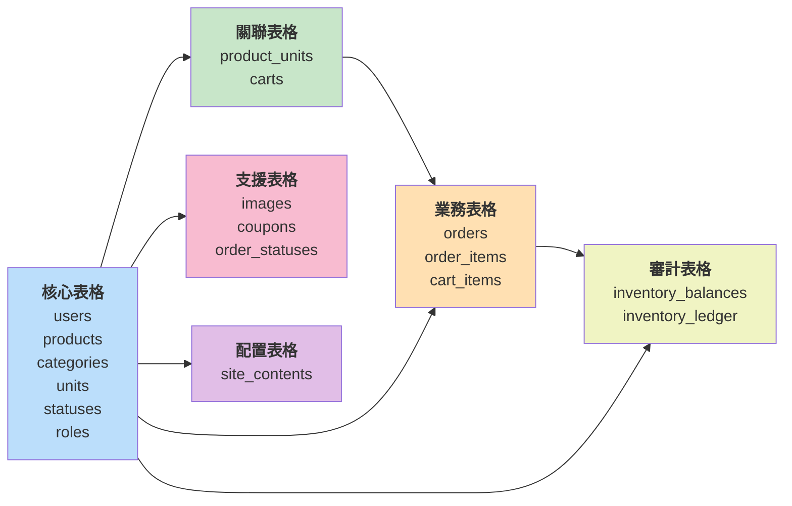
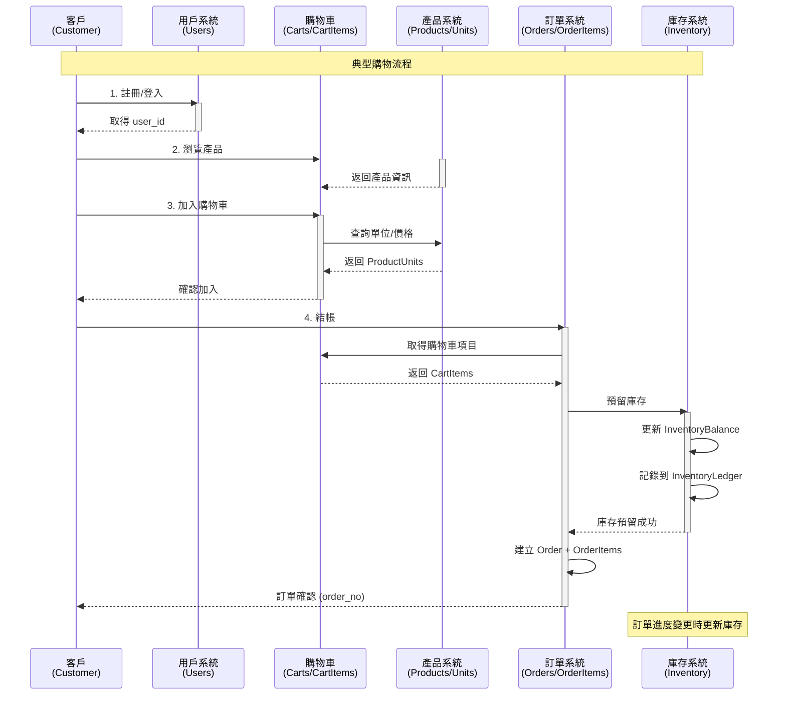
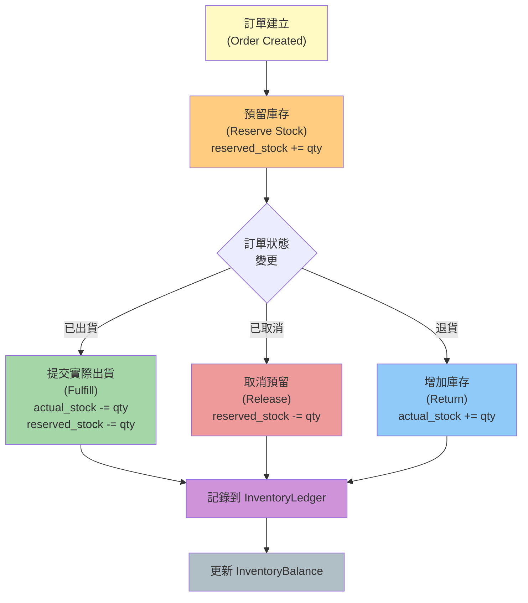
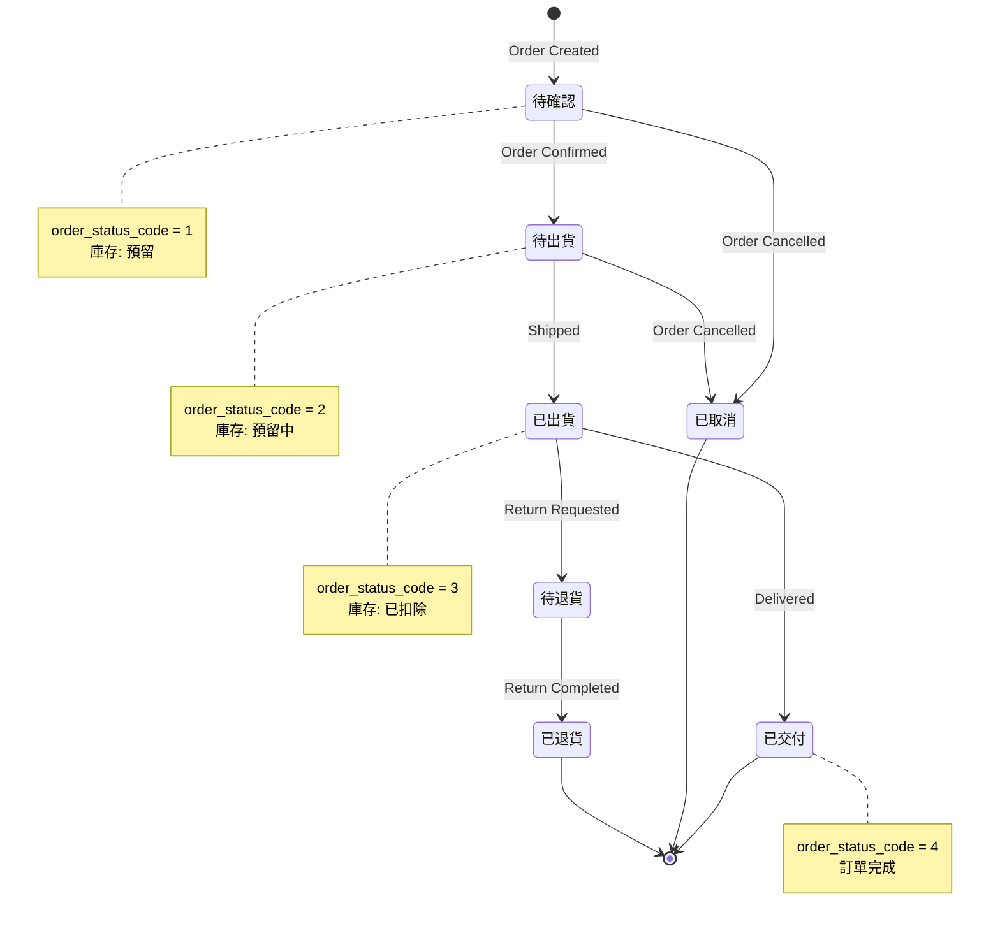
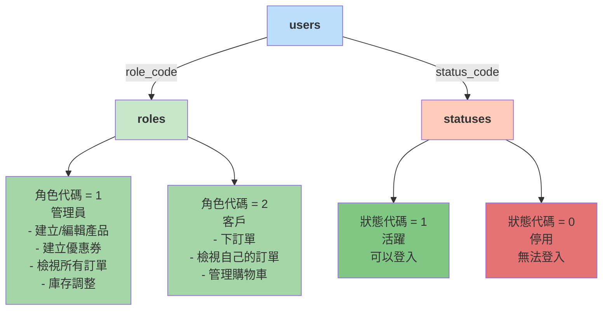
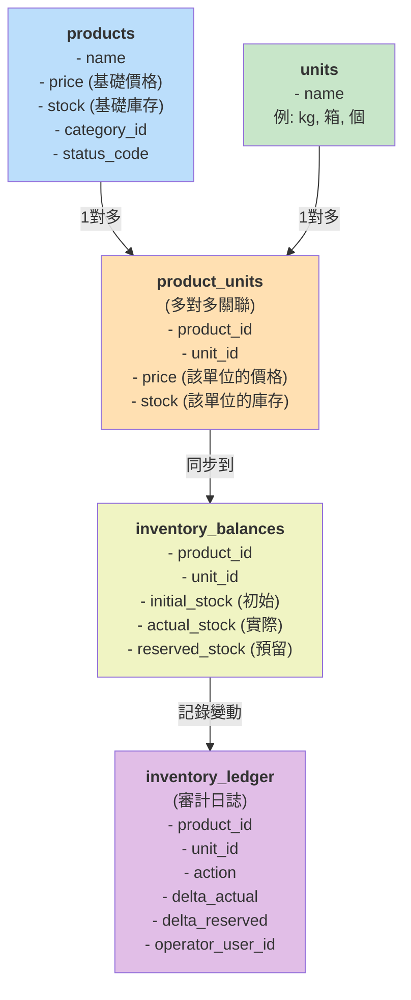
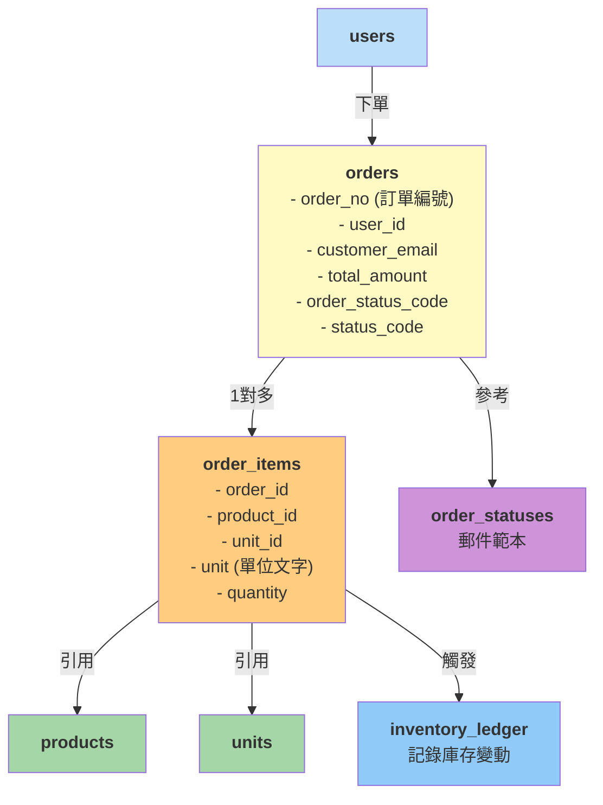

# 資料表關係圖 (Database ER Diagram)

## 簡化的實體關係圖

```mermaid
graph TB
    subgraph Users["用戶與認證"]
        Users["<b>users</b><br/>id, email, user_name<br/>role_code → roles<br/>status_code → statuses"]
        Roles["<b>roles</b><br/>id, code, name"]
    end

    subgraph Products["產品與分類"]
        Products["<b>products</b><br/>id, name, price, stock<br/>category_id → categories<br/>status_code → statuses"]
        Categories["<b>categories</b><br/>id, name, meta_data"]
        Units["<b>units</b><br/>id, name"]
        ProductUnits["<b>product_units</b><br/>product_id, unit_id<br/>price, stock<br/>(多對多關聯)"]
        Images["<b>images</b><br/>id, product_id, file_url<br/>is_primary, sort_order"]
    end

    subgraph Orders["訂單系統"]
        Orders["<b>orders</b><br/>id, order_no, customer_email<br/>user_id → users<br/>order_status_code → order_statuses<br/>status_code → statuses"]
        OrderItems["<b>order_items</b><br/>id, order_id, product_id<br/>unit_id, quantity"]
        OrderStatuses["<b>order_statuses</b><br/>id, code, name<br/>郵件範本"]
    end

    subgraph Shopping["購物車"]
        Carts["<b>carts</b><br/>id, user_id (唯一)"]
        CartItems["<b>cart_items</b><br/>id, cart_id, product_id<br/>unit_id, quantity"]
    end

    subgraph Inventory["庫存管理"]
        InventoryBalance["<b>inventory_balances</b><br/>id, product_id, unit_id<br/>initial_stock, actual_stock<br/>reserved_stock"]
        InventoryLedger["<b>inventory_ledger</b><br/>id, product_id, unit_id<br/>order_item_id, action<br/>delta_actual, delta_reserved<br/>operator_user_id → users"]
    end

    subgraph Promotions["促銷"]
        Coupons["<b>coupons</b><br/>id, code, name<br/>discount_type, discount_value<br/>status_code → statuses"]
    end

    subgraph System["系統配置"]
        Statuses["<b>statuses</b><br/>id, code, name<br/>(產品狀態, 用戶狀態等)"]
        SiteContents["<b>site_contents</b><br/>id, page_key<br/>content_data (JSONB)"]
    end

    %% 用戶關係
    Users --> Roles
    Users --> Statuses

    %% 產品關係
    Products --> Categories
    Products --> Statuses
    Products --> ProductUnits
    ProductUnits --> Units
    Products --> Images

    %% 訂單關係
    Orders --> Users
    Orders --> OrderStatuses
    Orders --> Statuses
    Orders --> OrderItems
    OrderItems --> Products
    OrderItems --> Units

    %% 購物車關係
    Carts --> Users
    CartItems --> Carts
    CartItems --> Products
    CartItems --> Units

    %% 庫存關係
    Products --> InventoryBalance
    Units --> InventoryBalance
    Products --> InventoryLedger
    Units --> InventoryLedger
    OrderItems --> InventoryLedger
    Orders --> InventoryLedger
    Users --> InventoryLedger

    %% 促銷
    Coupons --> Statuses

    style Users fill:#e1f5ff
    style Products fill:#f3e5f5
    style Orders fill:#fff3e0
    style Shopping fill:#e8f5e9
    style Inventory fill:#fce4ec
    style Promotions fill:#f1f8e9
    style System fill:#ede7f6
```

---

## 表格分層關係圖



---

## 資料流向圖



---

## 庫存管理流程圖



---

## 訂單狀態流程圖



---

## 使用者與權限關係圖



---

## 產品與庫存關係圖



---

## 訂單與項目關係圖



---

## 快速參考：外鍵關係表

| 表格 | 外鍵 | 參考表格 | 說明 |
|------|------|---------|------|
| users | role_code | roles | 用戶角色 |
| users | status_code | statuses | 用戶狀態 |
| products | category_id | categories | 產品分類 |
| products | status_code | statuses | 產品狀態 |
| product_units | product_id | products | 產考產品 |
| product_units | unit_id | units | 參考單位 |
| images | product_id | products | 所屬產品 |
| orders | user_id | users | 訂購用戶 |
| orders | order_status_code | order_statuses | 訂單處理狀態 |
| orders | status_code | statuses | 訂單基本狀態 |
| order_items | order_id | orders | 所屬訂單 |
| order_items | product_id | products | 訂購產品 |
| order_items | unit_id | units | 選擇單位 (可選) |
| carts | user_id | users | 用戶購物車 |
| cart_items | cart_id | carts | 所屬購物車 |
| cart_items | product_id | products | 購物車中的產品 |
| cart_items | unit_id | units | 選擇單位 (可選) |
| coupons | status_code | statuses | 優惠券狀態 |
| inventory_balances | product_id | products | 產品庫存 |
| inventory_balances | unit_id | units | 單位庫存 |
| inventory_ledger | product_id | products | 產品 |
| inventory_ledger | unit_id | units | 單位 |
| inventory_ledger | order_id | orders | 關聯訂單 (可選) |
| inventory_ledger | order_item_id | order_items | 關聯訂單項目 (可選) |
| inventory_ledger | operator_user_id | users | 操作人員 (可選) |

---

## 文件更新

- **建立日期**: 2026-06-24
- **最後更新**: 2026-06-24
